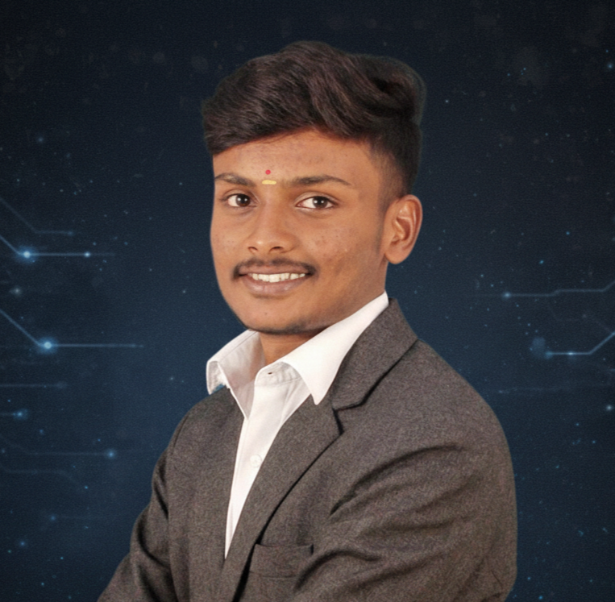

<!-- =====================================================
     K A R T H I K   M   S
     RTL × SPACE × SYSTEMS
===================================================== -->

<h1 align="center">Hey, I'm Karthik 👋</h1>

<h3 align="center">
Electronics & Communication Engineering Undergraduate 🚀
</h3>

  <i>Designing logic • Shaping signals • Engineering impact</i>

  

  🏛️ <b>IEEE Electron Devices Society (EDS) Member</b>

---

<!-- ================= TYPING HEADER ================= -->

  

<!-- ================= STATUS BAR ================= -->

  
  
  

## 🧠 About Me

<pre>
Name        : Karthik M S
Domain      : Electronics & Communication Engineering
Core        : RTL Design • Digital Electronics
Also Into   : Web Dev • UI Design • Hackathons
Affiliation : IEEE Electron Devices Society
Mindset     : Think in systems, build with intent
</pre>

I focus on **understanding systems internally** — from  
**logic gates and RTL timing** to **real-time applications and interfaces**.

Hackathons, problem-solving, and end-to-end building
are where I learn best.

## ⚙️ Tech Stack

  

  🧪 <b>LTspice</b> &nbsp;•&nbsp;
  🧠 <b>Vivado</b> &nbsp;•&nbsp;
  🔩 <b>Icarus Verilog</b> &nbsp;•&nbsp;
  ⚡ <b>Cursor</b> &nbsp;•&nbsp;
  ☕ <b>IntelliJ IDEA</b>

## 🧬 Hybrid RTL-Style Contribution Activity

  <i>Clock cycles don’t lie. Consistency is the real signal.</i>

  

  

  
  

## 🧩 LeetCode Activity

  

## 📈 GitHub Analytics

  

  

## 🌐 Connect With Me

  
  &nbsp;&nbsp;

  <!-- INSTAGRAM GLOW -->
  

  &nbsp;&nbsp;
  

  

⭐ From RTL to real systems — one commit at a time ⭐

